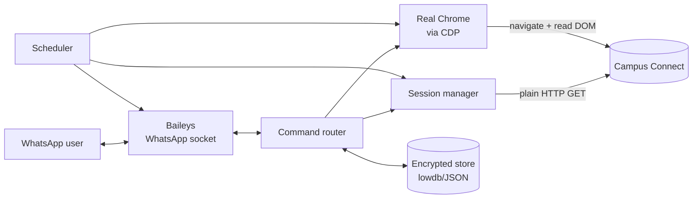

# Aditya Attendance Bot

A WhatsApp bot that answers live attendance questions — overall %, subject-wise breakdown, a bunk calculator, low-attendance alerts, and a daily summary — by reading Aditya University's Campus Connect student portal in real time. No password is ever stored; each user hands the bot a session cookie they capture themselves after logging in normally.

```
you: 1
bot: 🟡 Overall attendance

     66.87%  (224/335 classes)
     Target: 75.00%

     ❌ Below target. Attend 111 classes in a row to recover.

     Live from Campus Connect · 27 Aug, 7:23 PM
```

## Why this exists

Campus Connect has no API. Getting a live number into WhatsApp means dealing with a real production ASP.NET WebForms app: Cloudflare Turnstile on login, a data endpoint that only responds to a fully-executed real browser session, and a portal with no publicly documented behavior anywhere. Most of the engineering here is the result of methodically testing assumptions against the live site rather than guessing — see [docs/HLD.md](docs/HLD.md#key-design-decisions) for the investigation trail, including two dead ends (automated login, headless rendering) that turned out to be genuinely impossible, not just hard.

## Features

- **Live data, every time** — no command ever serves a cache; if the portal is reachable, the answer is current
- **Bunk calculator** — "how many can I skip / how many must I attend" per subject and overall, computed from real held/attended counts
- **Low-attendance alerts** — proactive WhatsApp ping when a subject drops below your target, with a cooldown so it doesn't spam
- **Daily summary** — scheduled overall + worst-subjects digest
- **No password storage** — only an encrypted session cookie is ever held; nothing that could authenticate as you from scratch
- **Self-healing sessions** — captures and persists cookie rotation (ASP.NET's sliding-expiration reissue) so sessions actually stay alive under continuous polling

## Architecture



Two separate paths hit the portal, deliberately:

- **Keepalive** is a plain HTTP GET (undici) — cheap, just needs the server to see *any* authenticated request to reset session expiry.
- **Actual data** goes through a real, independently-launched Chrome attached over the DevTools Protocol — required because the attendance data is populated by the page's own client-side JS, and (as it turns out) only when that JS runs in a real, non-headless browser. Full story in [docs/HLD.md](docs/HLD.md).

Full design docs: **[High-Level Design](docs/HLD.md)** · **[Low-Level Design](docs/LLD.md)**

## Tech stack

Node.js (ESM) · [Baileys](https://github.com/WhiskeySockets/Baileys) (WhatsApp Web protocol) · Playwright's `connectOverCDP` driving a real Chrome · cheerio (HTML parsing) · lowdb (JSON storage) · AES-256-GCM (credential encryption) · node-cron · Docker + Xvfb for deployment

## Running it

```bash
npm install
node -e "console.log(require('crypto').randomBytes(32).toString('hex'))"  # → SESSION_ENCRYPTION_KEY
# put that key in .env, see .env.example
npm start
```

Scan the QR code that prints to link WhatsApp, then message the bot `/start` — that's the only thing it responds to unprompted; everything else happens by navigating the menu it shows.

### Tests

```bash
npm test
```

80 tests across parsing, cookie extraction, session orchestration, command routing, scheduling, and the rendering pipeline (all mocked — nothing hits the live site in CI).

### Docker / deployment

```bash
docker build -t attendance-bot .
docker run -e SESSION_ENCRYPTION_KEY=... -v $(pwd)/data:/app/data attendance-bot
```

The volume mount is not optional — it holds the WhatsApp link and every linked user's encrypted session. See [docs/LLD.md](docs/LLD.md#deployment) for platform-specific notes (Render, Railway).

## What this bot deliberately does not do

- Does not store passwords, ever
- Does not attempt automated login (tried it — see [docs/HLD.md](docs/HLD.md#the-login-automation-dead-end) for why it's a genuine dead end, not a skipped feature)
- Does not mask or spoof any automation signal to get past a check designed to detect it — every workaround in this codebase (real Chrome, real display, cookie-based linking) is a legitimate different approach, not a disguise

## License

Personal project, built for a specific university's specific portal. Not affiliated with Aditya University.
