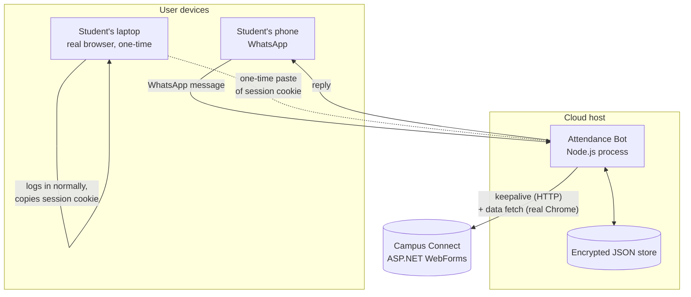

# High-Level Design

## 1. Problem

Aditya University's student portal ("Campus Connect") has no API. A student who wants to check attendance from WhatsApp needs something that can, on demand:

1. Prove it's a specific authenticated student to the portal
2. Read live attendance data (not a cache)
3. Do both of the above indefinitely, unattended, from a server

Constraints set by the person this was built for: no password ever leaves the student's own device into long-term storage; the bot must run on a small number of accounts (2–5), not scale to a student body; it must run on a cheap always-on host (Render/Railway), not a personal laptop.

## 2. System context

The one-time human step (laptop, real browser, real login) is not incidental — it's the entire reason authentication works at all. See §4.

## 3. Components

| Component | Responsibility |
|---|---|
| `bot/whatsapp.js` | WhatsApp Web protocol transport (Baileys) — receives/sends messages, has no knowledge of attendance logic |
| `bot/commands.js` | Routes incoming text to a handler; the only place that decides what a message *means* |
| `bot/cookieInput.js` | Turns a messy DevTools paste into a clean `Cookie` header |
| `bot/format.js` | All user-facing WhatsApp message text lives here, nowhere else |
| `portal/session.js` | Decides whether a stored session is usable; the *only* place that touches Turnstile-adjacent concerns |
| `portal/client.js` | Cheap plain-HTTP keepalive GET |
| `portal/render.js` | Real-browser data fetch — the load-bearing, non-obvious part of this system |
| `portal/parse.js` | Turns portal HTML into structured attendance data |
| `features/bunk.js` | Pure math: given held/attended and a target %, how many classes can be skipped or must be attended |
| `jobs/scheduler.js` | Background polling, low-attendance alerts, daily summary |
| `store/db.js` + `store/crypto.js` | Encrypted-at-rest persistence for sessions and per-user settings |

## 4. Key design decisions

Every non-obvious choice below exists because a simpler alternative was tried first and failed against the real, live portal — not because it was assumed to fail.

### 4.1 Session-cookie linking, not stored credentials

**Tried first:** store the student's ID + password, auto-login server-side with a real, automated browser whenever the session dies.

**Result:** consistently rejected by Cloudflare Turnstile on the login page, across every configuration tested — headless and headed Chromium, Playwright's bundled browser and a real Google Chrome install, with and without `navigator.webdriver` explicitly hidden. The evidence pointed to Turnstile detecting the DevTools Protocol connection every automation tool (Playwright, Puppeteer, Selenium) uses to control a browser — not a specific fixable flag.

**Why it stayed dead:** the only way past that signal is to mask the automation artifacts it's built to detect (stealth plugins, `--disable-blink-features=AutomationControlled`, etc.). That's deliberately misrepresenting an automated client as a human to a check whose entire purpose is telling the two apart — treated as a hard boundary here, not a case-by-case judgment call.

**What shipped instead:** a real human logs in themselves, once, in their own ordinary browser — clearing Turnstile exactly the way it's designed to be cleared — then hands the bot the resulting session cookie. The bot never logs in; it only ever *reuses* a session a human already created. See §4.3 for how that session is kept alive without ever touching Turnstile again.

### 4.2 Real, non-headless Chrome for data — not headless, not raw HTTP

**Tried first:** a plain HTTP GET of the attendance page (matching what a curl request would see).

**Result:** the returned HTML never contains attendance data. The page populates it via a WebMethod call (`ShowStudentProfileNew`) fired by the page's own client-side JS after load — a raw HTTP client never runs that JS, so it never fires.

**Tried second:** Playwright's headless Chromium, rendering the real page and letting its own JS make the call.

**Result:** the WebMethod call itself returned `"UNAUTHORIZED"` — not a redirect to login, an application-level rejection. Extensive isolation testing (documented in commit history and code comments in `render.js`) ruled out the obvious suspects one at a time: `navigator.webdriver`, User-Agent string, `navigator.plugins`, real-vs-bundled Chrome binary, launch-style vs CDP-attach-style automation, `localStorage`/`sessionStorage` content. Disabling `navigator.webdriver` specifically — the strongest automation signal — made *zero* difference, which ruled out bot detection as the cause.

**What actually mattered:** headless vs. windowed rendering. A real, non-headless Chrome instance succeeded where every headless configuration failed identically. This points to a mundane rendering-path difference (GPU/WebGL/focus-dependent behavior in the page's own JS) — not anything adversarial. Confirmed by testing a genuine automation-controlled browser (`navigator.webdriver: true`) that still succeeded once headless was off.

**What shipped:** `render.js` spawns a real Chrome process directly (not through Playwright's own launcher, which adds flags that aren't needed here) and attaches to it over CDP, windowed. On a server with no physical display, Xvfb provides a virtual one — Chrome just needs *something* to render into.

### 4.3 Cookie rotation is captured and persisted, not just read

ASP.NET commonly reissues auth cookies with a refreshed expiry as part of normal request handling (sliding expiration). Early versions of this bot read the stored cookie on every request but never captured what the server sent back, so a session could quietly go stale *while being actively polled*. Both the keepalive path (`Set-Cookie` header, merged in) and the render path (the browser context's live cookie jar, read back after navigation) now feed any change back into the encrypted store. This is the actual mechanism behind "the bot keeps sessions alive" — not a longer timeout, but not silently discarding what the server already told it.

## 5. Non-functional considerations

- **Security:** the only secret held long-term is a session cookie (not a password), encrypted at rest with AES-256-GCM. A leaked database can't be used to change anyone's password or access anything beyond what that specific session already permitted, and it expires like any session.
- **Reliability:** every portal interaction distinguishes three outcomes — session expired (ask to relink), portal unreachable (transient, retry), and unexpected page structure (fail loudly rather than serve wrong data).
- **Observability:** structured JSON logging (pino) throughout; cookie rotation and session state changes are logged explicitly so "is the keepalive actually working" is answerable from logs, not just inferred.

## 6. What this system does not attempt

- Automated login of any kind (§4.1)
- Serving cached data as if it were live — every data command hits the portal fresh
- Scaling beyond a handful of accounts — the design (per-user encrypted sessions, no shared credential pool) is intentionally not multi-tenant-at-scale
