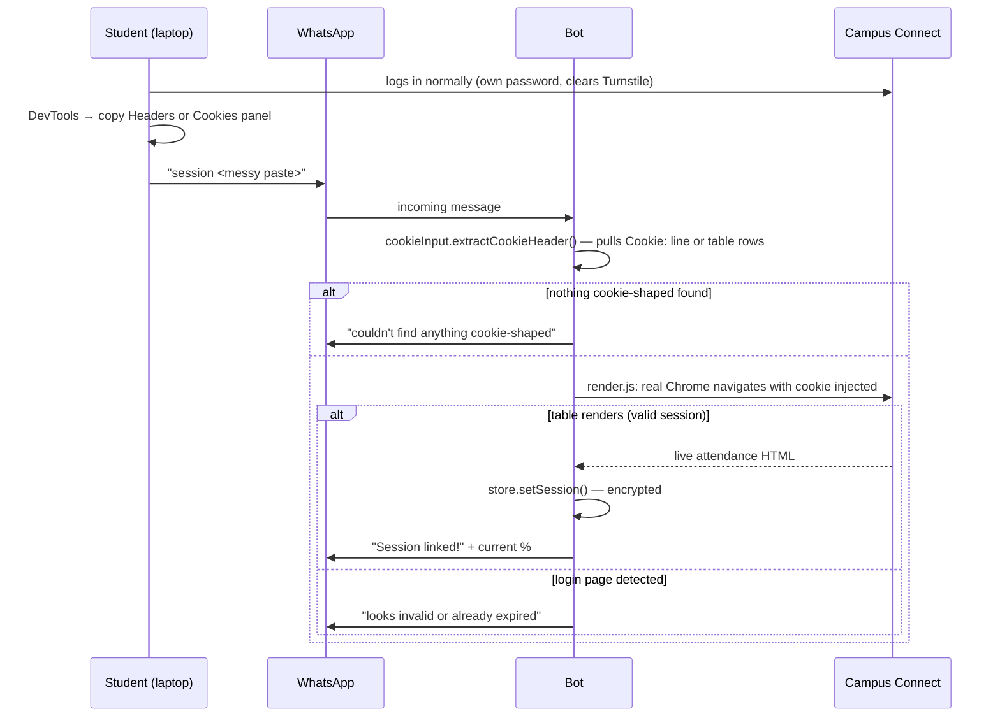
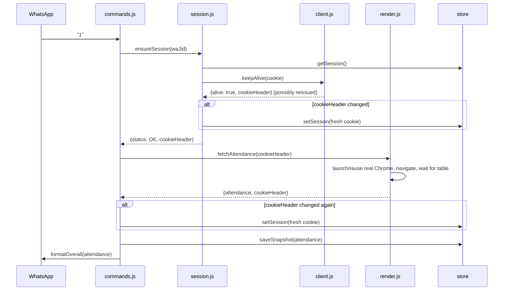

# Low-Level Design

Companion to [HLD.md](HLD.md) — this covers module boundaries, data shapes, sequence flows, and error handling in enough detail to modify the system safely.

## 1. Module map

```
src/
├── index.js              entry point: wires store, WhatsApp, scheduler, health server
├── health.js             minimal HTTP 200 responder for platform health checks
├── config.js             env var loading + validation, single source of truth for tunables
├── bot/
│   ├── whatsapp.js        Baileys transport — no attendance logic
│   ├── commands.js        message → handler routing, orchestrates session + fetch + reply
│   ├── cookieInput.js     forgiving parser: messy DevTools paste → clean Cookie header
│   └── format.js          every WhatsApp-facing string, nowhere else
├── portal/
│   ├── session.js         "is this session usable right now" — the auth boundary
│   ├── client.js          plain-HTTP keepalive GET, Set-Cookie capture/merge
│   ├── render.js          real-Chrome data fetch (the load-bearing module — see HLD §4.2)
│   └── parse.js           HTML → structured attendance data (cheerio)
├── features/
│   └── bunk.js            pure functions: attendance ratios → skip/attend advice
├── jobs/
│   └── scheduler.js       interval poll (keepalive + alerts) + daily cron summary
└── store/
    ├── db.js              lowdb-backed persistence, one record per WhatsApp user
    └── crypto.js          AES-256-GCM encrypt/decrypt for the one secret at rest
```

Dependency direction is strictly downward: `bot/` depends on `portal/` and `features/`, never the reverse; `portal/` modules don't know WhatsApp exists.

## 2. Data model

Single collection, one document per linked WhatsApp user (`store/db.js`):

```ts
type User = {
  id: string;                    // internal UUID
  waJid: string;                 // WhatsApp JID, the lookup key
  session: EncryptedBlob | null; // { iv, tag, data } — AES-256-GCM ciphertext of the Cookie header
  sessionLinkedAt: string | null;
  target: number;                // attendance target as a fraction, e.g. 0.75
  lastSnapshot: Attendance | null;
  lastAlertAt: Record<string, string>; // subject code → ISO timestamp, for alert cooldown
  dailySummary: boolean;
  createdAt: string;
};

type Attendance = {
  subjects: Array<{
    slNo: number; code: string; name: string;
    facultyId: string; faculty: string;
    held: number; attended: number;
    percent: number;        // computed from held/attended, not trusted from the page
    reportedPercent: number; // what the portal itself displayed, kept for debugging drift
  }>;
  total: { held: number; attended: number; percent: number };
  fetchedAt: string; // ISO timestamp — every reply shows this so "live" is verifiable
};
```

`EncryptedBlob` is the only thing in the store that's ever a secret. Nothing else — not even in combination — can be used to authenticate as the student.

## 3. Sequence: linking



## 4. Sequence: a data command (e.g. "1")



Two independent points capture cookie rotation (`session.js` after keepalive, `commands.js`/`scheduler.js` after the actual fetch) because either request can be the one the server chooses to reissue on.

## 5. Error taxonomy

Every portal-facing function throws one of exactly three typed errors, and every caller handles all three explicitly — no generic catch-and-ignore.

| Error | Meaning | Bot's response |
|---|---|---|
| `SessionExpiredError` | Portal redirected to login, or rendered page shows login markers | Clear stored session, ask user to relink |
| `AttendanceUnavailableError` | Authenticated fine, but the expected table structure wasn't found | Treated as a bug signal (portal layout changed) — logged, generic retry message |
| `PortalUnreachableError` | Network failure, non-2xx status, Chrome launch failure, CDP timeout | Transient — retry message, falls back to last known snapshot if one exists |

`portal/parse.js` is the single place that classifies HTML into one of these three outcomes (`isLoggedOut()` for the first, table-presence for the second). Both `client.js` and `render.js` funnel through it, so the classification logic exists exactly once.

## 6. `bunk.js` — the calculator

Given `attended` of `held` classes and target ratio `T`:

- **Can skip:** `floor(attended / T - held)` — solves for how many more misses keep the ratio at or above `T`
- **Must attend:** `ceil((T·held − attended) / (1 − T))` — solves for consecutive attendance needed to reach `T`

Both assume every future class is either attended or skipped (no partial credit), matching how the portal itself counts. `T = 1` is handled as a special case (division by `1 − T` would divide by zero) — either already perfect or unrecoverable by definition.

## 7. Testing strategy

80 tests, all offline — no test hits the live portal. Three layers:

1. **Fixture-based parsing** (`parse.test.js`) — a captured, structurally-accurate HTML fixture (`__fixtures__/profile.js`) exercises every parsing edge case found in the real markup: hyphenated course names, single-digit faculty IDs, a colspan'd total row.
2. **Mocked module boundaries** (`session.test.js`, `commands.test.js`, `scheduler.test.js`, `render.test.js`) — use Node's built-in `node:test` module mocking (`--experimental-test-module-mocks`) to fake `playwright`, `node:child_process`, and internal modules, verifying control flow (which branch fires for which server response) without any real browser or network call.
3. **Pure functions** (`bunk.test.js`, `cookieInput.test.js`) — direct input/output assertions, including the numeric edge cases (100% target, zero classes held) and the messy real-world paste formats `cookieInput.js` needs to tolerate.

## 8. Deployment

Docker image: `node:20-bookworm-slim` + Google Chrome (real, not Chromium) + Xvfb. See root `Dockerfile` and `docker-entrypoint.sh`.

Required at runtime:
- `SESSION_ENCRYPTION_KEY` — 64 hex chars (32 bytes), generate once and keep stable (rotating it invalidates every stored session)
- Ideally, a **persistent volume mounted at `/app/data`** — holds the WhatsApp link (`data/wa-auth`) and every user's encrypted session (`data/db.json`). Without it, every redeploy or restart forces a fresh WhatsApp QR scan and every linked user to relink.
- `--no-sandbox --disable-dev-shm-usage` are baked into `render.js`'s Chrome launch args — required for Chrome to run as root in a container; unrelated to the headless-vs-windowed finding in HLD §4.2.

**Render (current deployment target, see [`render.yaml`](../render.yaml)):** the free plan is Web Service only — Background Worker isn't offered on it, and the free plan has no persistent disk at all, at any price point below Starter. That forces a different tradeoff than a paid host with a volume:

- Deployed as a free **Web Service** (not Worker) specifically so `health.js`'s HTTP listener has something to answer — that endpoint is also the ping target.
- Free Web Services sleep after 15 minutes idle. [`.github/workflows/keepalive.yml`](../.github/workflows/keepalive.yml) pings the deployed URL every 10 minutes via GitHub Actions to prevent that sleep. This only addresses idle-sleep.
- It does **not** address the missing persistent disk — `/app/data` lives in the container's ephemeral filesystem and is wiped on every redeploy and on any Render-initiated restart, independent of the ping. Everyone relinks when that happens.
- Upgrading to Render's paid **Starter** plan adds a real persistent disk, removing this tradeoff entirely (config for that is preserved in git history at commit `2d9e9ba`, before the pivot to the free tier).

**Railway:** standard Dockerfile deploy; attach a volume at `/app/data` the same way. No free tier as of 2026 — paid only.
